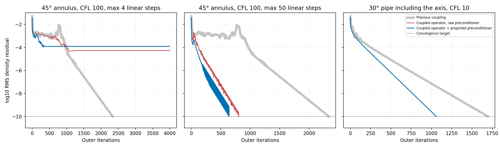

# Isolated periodic implicit convergence and cost assessment

**Status: #2967 was closed at the user’s request on 2026-10-07.** This experiment is deferred; its branch and evidence are retained. The seven active periodic bug-fix PRs do not depend on it.

Classification correction after reviewing the original implementation discussion: F/#2967 is a proposed numerical enhancement, labeled **changelog:feature**, with **priority removed**, and explicitly **not ready to merge**. The maintainer [explained](https://github.com/su2code/SU2/issues/763#issuecomment-524007345) that omitted neighboring Jacobian terms were a deliberate approximation to reduce communication/sparse-matrix costs. The new dense-reference tests verify the proposed complete operator; disagreement with that operator alone does not prove the old approximation was an implementation bug. #1585 explored the same class of enhancement and recorded preconditioner/adjoint difficulties. Current evidence does not establish resolution of #763/#1467 or an overall speedup. This supersedes earlier descriptions of F as a confirmed bug fix; the genuine correctness fixes in the other branches are unaffected. No production code or PR state changed.

These cases measure outer convergence, Krylov work and elapsed time while keeping all other periodic fixes identical. Fewer outer iterations do not necessarily make a run faster.

## Protocol

The starting source is the combined periodic checkpoint `2d3622408c` (numerical code equivalent to `862f5ab855`). It contains A–G. Only F's implicit coupling is varied: the benchmark-only driver hook in `gain-driver.patch` disables `HasPeriodicProjection` for the `legacy` mode after solver construction. All F-specific residual, row, volume and product paths use that flag. `fixed` leaves the complete coupled operator enabled. This switch is private test instrumentation, not a production option. The fixed mode matches the unchanged validated binary exactly for 30 iterations; the two verification histories are included.

**The projected preconditioner is an unpublished experiment.** The published F branch and combined branch were restored unchanged after the experiment failed mixed-precision checks. No production commit was made from it.

The comparison also tests a projected preconditioner, `P B P + I-P`, with the same complete matrix operator. Its patch is included. This preserves periodic consistency and treats the complementary subspace as identity. The matrix-owned workspace is shared across OpenMP threads; the factory creates a wrapper per thread.

Every paired run uses the same mesh, initial conditions, CFL, spatial scheme, preconditioner choice, linear tolerance, linear iteration cap, output and stopping condition. The stopping condition is `log10(rms[Rho]) <= -10`, with a 4000-iteration cap. The two 45-degree tests differ only in the maximum linear iterations (4 versus 50); the larger-budget case is separately identified. No adaptive CFL. One OpenMP thread, plus separate two-MPI-rank controls. Runs use scoped `timeout` and wait for shared-machine load <=6 before starting.

Times include solver startup/output and MPI startup, but exclude waiting for machine load. This is a shared machine with other work, so single-run elapsed times are indicative. No general wall-time speedup is claimed.

## Serial results

| Case | Coupling / preconditioner | Outer iterations | Total linear iterations | Outcome |
|---|---|---:|---:|---|
| 45-degree annulus, CFL100, max4 | Legacy | 2337 | 5063 | Converged |
| Same | Coupled operator, raw preconditioner | 4000 | 16000 | Stalled at -4.2736 |
| Same | Coupled operator, projected preconditioner | 4000 | 16000 | Stalled at -3.9080 |
| 45-degree annulus, CFL100, max50 | Legacy | 2337 | 5063 | Converged |
| Same | Coupled operator, raw preconditioner | 807 | 19818 | Converged |
| Same | Coupled operator, projected preconditioner | 643 | 7846 | Converged |
| 30-degree pipe with axis, CFL10, max20 | Legacy | 1698 | 6792 | Converged |
| Same | Coupled operator, raw preconditioner | 1062 | 21240 | Converged |
| Same | Coupled operator, projected preconditioner | 1062 | 12682 | Converged |

For the published implementation (raw preconditioner), the larger-budget annulus uses 65.5% fewer outer iterations but 3.9 times the linear work; the pipe uses 37.5% fewer outer iterations but 3.1 times the linear work. Both are slower in the recorded serial runs. These are improvements in outer convergence, not an established overall gain.

With the experimental projected preconditioner, the larger-budget annular case takes 72.5% fewer outer iterations than legacy, but 55% more total linear iterations. The pipe takes 37.5% fewer outer iterations but 86.7% more linear work and remains slower. Relative to the same coupled operator with raw preconditioning, projection reduces linear work by 60.4% in the annulus and 40.3% in the pipe.

The limited four-step solve is a remaining robustness regression. The enlarged-budget result does not erase it. Any future reconsideration of #2967 requires assessment of this behavior, full branch CI/regression references, CFD/geometry adjoints, multigrid forcing and ALE/GCL; it is currently closed.

For the experimental projected-preconditioner variant, at the shared density-residual target, converged primary/thermodynamic fields agree with legacy within 3.2e-6 for the annulus and 7.6e-8 for the pipe on each field's stated scale `max(1,max|baseline field|)`. `compare_steady_fields.py` contains the runnable <=1e-5 check and `steady-field-comparison.json` records each field. The stopping condition is density residual, not a claim that every residual component meets the same threshold.

## Two-rank MPI controls of the published implementation

| Case | Coupling | Outer iterations | Total linear iterations | Outcome |
|---|---|---:|---:|---|
| 45-degree annulus, CFL100, max4 | Legacy | 1684 | 5797 | Converged |
| Same | Coupled operator, raw preconditioner | 4000 | 16000 | Stalled at -6.8032 |
| 30-degree pipe with axis, CFL10, max20 | Legacy | 1698 | 11859 | Converged |
| Same | Coupled operator, raw preconditioner | 1062 | 21240 | Converged |

The low-budget regression also occurs with partitioned MPI. These controls do not validate the experimental projected preconditioner under MPI.



## Files and reproduction

Each case/mode folder contains the exact `run.cfg`, mesh, inlet profile where needed, `history.csv`, `run.log`, final restart and `result.json` with command, environment, return code, timing, outer count, linear-work sum and final residuals. `fixed-initial` means the coupled operator with raw preconditioning; `fixed` means projected preconditioning. `legacy-initial` and verification folders retain control snapshots. `*-mpi2` folders are genuinely partitioned two-rank runs of the raw-preconditioner implementation.

Apply the private driver patch to the combined source before building a comparison binary. For the projected-preconditioner variant, also apply `projected-preconditioner.patch` to the recorded F base (the relevant code is identical in the combined checkpoint). Rebuild both `CSysSolve.cpp` and `CNewtonIntegration.cpp`: both instantiate the shared factory. Mixing old/new template definitions is not a valid comparison. `gain-build-commands.json` records the original private driver compile/archive/link commands.

Run from a case directory, using the appropriate binary:

```sh
OMP_NUM_THREADS=1 SU2_PERIODIC_COUPLING_COMPARE=legacy timeout -k 5 300 /path/to/SU2_CFD run.cfg
OMP_NUM_THREADS=1 SU2_PERIODIC_COUPLING_COMPARE=fixed timeout -k 5 300 /path/to/SU2_CFD run.cfg
```

For MPI controls add `mpirun -np 2` after `timeout` and before the binary. Use the same mode and binary consistently. The experimental C++ dense test independently checks the coupled matrix, transpose, solves and preconditioner subspaces for translation, helical rotation and two/three periodic pairs, with Jacobi, ILU and LU-SGS. The existing implementation fails 21 of 8796 assertions; the projected variant passes all 8796 in serial. The expanded mixed-precision test failed two forward/reverse solution checks for translation/ILU at a 1e-7 solver target (about 0.0039/0.0046 error versus a 0.000345 bound). A 1e-6 target did not resolve it: five solve checks failed, including Jacobi and LU-SGS. Product and preconditioner-subspace checks passed. This also occurs with one thread. The synthetic matrix has off-diagonal terms that grow with global row number; poor conditioning is a hypothesis, not a confirmed explanation. A separate condition-number diagnostic was queued but cancelled while shared-machine load stayed high. Its script is provided for the next assessment. No bound was loosened to make these tests pass. MPI/OpenMP/reverse-AD validation of this experiment is incomplete, and it was not pushed as production code. The earlier published operator/callback correctness checks remain separate evidence; this is not a full CFD/geometry sensitivity claim.

The recorded private benchmark harness expects the original `pr_bundle` tree alongside its scratch root. The exact case folders and shell commands above are self-contained reproductions; the plot and steady-field checks run directly from this evidence folder.
