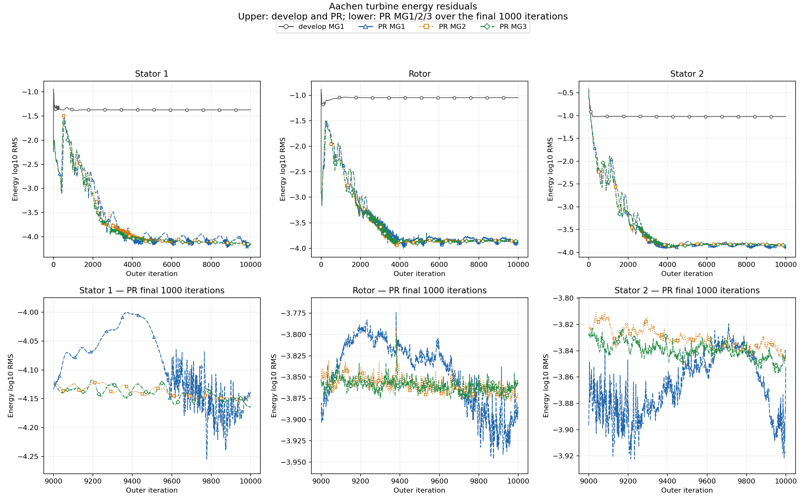

# Aachen turbine: rotational periodic boundaries and multigrid

Follow-up to the turbomachinery/MG review request in [SU2 PR #2961](https://github.com/su2code/SU2/pull/2961#pullrequestreview-5459938243).

## Regression coverage

The PR already sets `MGLEVEL=1` in `TestCases/turbomachinery/Aachen_turbine/aachen_3D_MP_restart.cfg`, exercising the coarse-grid rotational velocity transfer in all three zones. The existing `aachen_turbine_restart` tests cover it in the serial and MPI suites at iteration 5. Reference values were refreshed from the earlier serial/MPI CI runs in commit `492d2ebdc4`; the MG configuration was added in `609f0c2e4c`.

The long runs below supplement that short regression. Their iteration cap is not the CI test length and is not a convergence criterion.

## Completed cluster study

All four cases completed 10,000 outer iterations (CSV iterations 0–9999), with eight MPI ranks and one thread per rank. Controls are identical except MG depth: fixed fine-grid CFL 2, SA CFL factor 0.1, JST mean-flow flux, FGMRES/LU-SGS, 15 linear iterations and tolerance 1e-4. The requested MG depth was retained in every zone.

Develop uses `f110e914b5fd0d31c889e2d4df5bb5683abc6fd6`. The PR branch is `fix_periodic_rotation`, updated to `ef373c97061843470911af6319e9c66b943b3a01`, including that develop base and merged SA fix #2957. The earlier PR run without the aligned base is excluded.

**Provenance limit:** MG1's returned build-info template still says `6280ff1741`; its recorded binary hash is identical to MG2/MG3, whose expected labels say `ef373c9706`. Labels and binary hashes do not independently attest compiled source. The supplied initial inputs are included and hashed, but the cluster runs did not return independent initial-input fingerprints.

| Case | Energy log10 RMS: stator 1 / rotor / stator 2 | Reported efficiency % | Reported global mass mismatch % | Worst interface mismatch % |
|---|---|---:|---:|---:|
| develop MG1 | -1.3751 / -1.0490 / -1.0224 | 71.42338 | 0.63528 | 0.31576 |
| PR MG1 | -4.1381 / -3.8848 / -3.8523 | 72.59383 | 0.54745 | 0.30008 |
| PR MG2 | -4.1485 / -3.8750 / -3.8418 | 72.59685 | 0.54938 | 0.30007 |
| PR MG3 | -4.1638 / -3.8581 / -3.8479 | 72.59588 | 0.54940 | 0.30008 |

At the common endpoint, the PR's three energy residuals are 2.76–2.84 orders lower than develop. The reported efficiency difference is about 1.17 percentage points; it does not establish calibrated turbine accuracy.

| PR depth | Energy peak-to-peak log10 RMS over iterations 9000–9999: stator 1 / rotor / stator 2 |
|---|---|
| MG1 | 0.2545 / 0.1724 / 0.1029 |
| MG2 | 0.0335 / 0.0863 / 0.0366 |
| MG3 | 0.0481 / 0.0759 / 0.0348 |

Additional levels damp late oscillations but do not remove the energy floor or establish convergence. MG3 is not uniformly better than MG2; no reliable timing comparison is available, so no speedup is claimed. All logs report the iteration cap before convergence. Efficiency still drifts by about 0.013 percentage points over the final 200 iterations. The history-based mass mismatch is not an independent discrete-conservation audit.



- [All mean-flow and SA residuals](all-residuals.png), [PDF](all-residuals.pdf).
- [Performance and mass-flow mismatch](performance-comparison.png), [PDF](performance-comparison.pdf).
- [Detailed metrics and original snapshot hashes](comparison.json).

## Separate wall-function follow-up

The Aachen study also exposed the existing wall-temperature state inconsistency tracked in [issue #2955](https://github.com/su2code/SU2/issues/2955). A separate temperature-only experiment keeps the model's aerodynamic wall temperature local and removes the saved pressure/density/temperature inconsistency. Cache refresh and inactive SA boundary handling are being checked separately. The safeguarded wall-solver experiment has larger late residual oscillations and remains under investigation; it is not presented as a validated convergence improvement. These experimental changes are not included in this periodic PR or the four runs above.

## Files and reproduction

`inputs.tar.gz` contains the original shared mesh, equation file and three initial restart files. `histories.tar.gz` contains the unmodified four history CSVs for each run. The four configuration sets are in `configs/` with trailing whitespace normalized and all option values preserved; returned build labels and executable fingerprints are in `provenance/`. `SHA256SUMS` verifies the archives, and `archived-files-sha256.json` records the exact member hashes. Large output VTU, executables and machine-specific job logs are not included; spatial consistency diagnostics in the metrics are summaries.

Verify and regenerate the figures without running CFD:

```bash
sha256sum -c SHA256SUMS
python3 plot.py
```

The plot script needs Python 3 and Matplotlib. It checks every archived CSV hash and the full iteration sequence. Figures directly overlay each variable across cases, with distinct styles and staggered hollow markers; no residual differences or numerical offsets are plotted.

To rerun one case using an MPI-enabled build of the corresponding revision:

```bash
./run.sh develop_mg1 /absolute/path/to/develop/bin/SU2_CFD
./run.sh pr_mg1 /absolute/path/to/pr/bin/SU2_CFD
./run.sh pr_mg2 /absolute/path/to/pr/bin/SU2_CFD
./run.sh pr_mg3 /absolute/path/to/pr/bin/SU2_CFD
```

Each command creates a fresh `runs/<case>` directory and uses eight MPI ranks with one thread each. It refuses to reuse an existing run directory. No Git is needed on compute nodes. Submit the commands through the scheduler appropriate to the cluster; `run.sh` does not itself submit SGE jobs.

## CI status when publishing, 9 October 2026

The first attempt of the latest [regression workflow](https://github.com/su2code/SU2/actions/runs/37905153455) failed: ReverseMPI, ForwardNoMPI and ForwardOMP could not fetch Eigen because GitLab reported being unable to handle the requests due to load. The standard regression/unit jobs were consequently skipped. Code style, CodeQL and the sanitizer test jobs completed successfully. A retry of the failed jobs was requested on 9 October; its outcome was pending when publishing this study. This record does not claim that the full latest CI passed.
